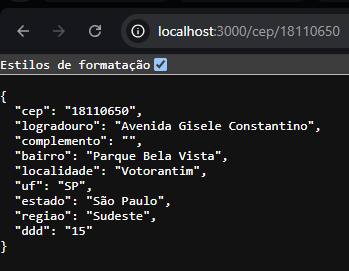

# 📍 API de Consulta e Integração de CEP

Este projeto consiste no desenvolvimento de uma **API REST** utilizando o ecossistema **Node.js** e o framework **Express**. O objetivo principal é atuar como um microsserviço intermediário de busca e padronização de endereços, consumindo os dados oficiais do serviço [ViaCEP](https://viacep.com.br/).

A aplicação foi idealizada para resolver um problema comum em sistemas web: receber um dado bruto do cliente, tratá-lo, buscar a informação em um serviço externo confiável e devolver uma resposta limpa e estruturada. O projeto também foi **containerizado com Docker**, garantindo que rode de forma idêntica em qualquer ambiente, independente de configurações locais da máquina.

---

## 🚀 Deploy em produção

* **API (Render):** [https://busca-cep-b1ak.onrender.com](https://busca-cep-b1ak.onrender.com)
* **Front-end de demonstração (GitHub Pages):** _link disponível após publicação_

> ⚠️ A API está hospedada no plano gratuito do Render — após um período de inatividade, o serviço "dorme" e a primeira requisição pode levar de 30 a 60 segundos para responder enquanto ele reinicia.

**Exemplo de chamada direta:**
```
GET https://busca-cep-b1ak.onrender.com/cep/18110650
```

---

## 🎯 Escopo do Projeto

O sistema funciona como uma ponte de comunicação assíncrona entre o cliente e a base de dados pública do ViaCEP. O fluxo de funcionamento do projeto segue a seguinte lógica:

1. **Entrada de Dados:** A API expõe um ponto de acesso (endpoint) que aguarda o recebimento de um CEP enviado dinamicamente na URL.
2. **Sanitização:** O código remove automaticamente qualquer caractere especial do CEP recebido (hífens, espaços, etc.), aceitando o dado tanto formatado quanto puro.
3. **Validação de Negócio:** Após a limpeza, o CEP é validado quanto ao formato — precisa conter exatamente 8 dígitos numéricos — evitando requisições desnecessárias ao serviço externo.
4. **Consumo de API de Terceiros:** Utilizando programação assíncrona (`async/await`) com Axios, o servidor Node.js dispara uma requisição para a URL estável do serviço externo.
5. **Tratamento de Exceções:** O projeto prevê cenários de erro, tanto para formato de CEP inválido (`400`) quanto para falhas na consulta ao serviço externo (`500`).
6. **Sanitização da Resposta:** Os dados retornados pelo ViaCEP são filtrados e devolvidos ao usuário final em formato JSON.

---

## 🛠️ Tecnologias e Conceitos Aplicados

* **Ambiente de Execução:** Node.js
* **Roteamento HTTP:** Express Framework
* **Comunicação Assíncrona:** Axios
* **Tratamento de Erros:** Blocos de controle `try / catch`
* **Formato de Dados:** JSON (JavaScript Object Notation)
* **Containerização:** Docker

---

## 🐳 Rodando com Docker

### Produção
```bash
# Construir a imagem
docker build -t api-cep .

# Rodar o container
docker run -p 3000:3000 api-cep
```

### Desenvolvimento (com Hot Reload)
O ambiente de desenvolvimento utiliza **nodemon** integrado ao container via **Bind Mounts**, sincronizando o código local com o container em tempo real — qualquer alteração salva reinicia o servidor automaticamente, sem precisar reconstruir a imagem.

```bash
docker run -p 3000:3000 -v "${PWD}:/api-cep" api-cep
```

**Scripts disponíveis no `package.json`:**
* `npm run dev` — inicia com nodemon (hot reload), usado como comando padrão do container
* `npm start` — inicia em modo produção, sem hot reload

## ▶️ Rodando localmente (sem Docker)

```bash
npm install
node index.js
```

## 🧪 Teste da API em execução

Para comprovar o funcionamento da API, abaixo está uma consulta real, comparando o endereço retornado com um local existente e conhecido (Shopping Iguatemi Esplanada, em Votorantim/SP):


```
GET http://localhost:3000/cep/18110650
```

**Resposta da API:**



O endereço retornado (Avenida Gisele Constantino, Parque Bela Vista, Votorantim/SP) confere exatamente com o endereço real do local, validando a integração com o ViaCEP.

## 📡 Exemplo de uso

```
GET http://localhost:3000/cep/01001000
```

**Resposta:**
```json
{
  "cep": "01001000",
  "logradouro": "Praça da Sé",
  "complemento": "lado ímpar",
  "bairro": "Sé",
  "localidade": "São Paulo",
  "uf": "SP",
  "estado": "São Paulo",
  "regiao": "Sudeste",
  "ddd": "11"
}
```

**Resposta com CEP inválido (`GET /cep/123`):**
```json
{
  "erro": "CEP inválido"
}
```